# 1. Getting Around Charles de Gaulle Airport

-   Paris-Charles de Gaulle Airport offers several free transport options to make it easier for passengers to move between terminals, halls, and key access points across the airport.
-   The CDGVAL automated shuttle, bus shuttles N1 and N2, the LISA shuttle, and the transport facilities around Roissypôle allow for quick and efficient movement throughout the airport complex.

## 1.1 What is Roissypole?

-   Roissypôle is the name of a complex of airport hotels, office buildings, train and bus stations at Paris-Charles de Gaulle Airport.
-   Roissypôle is easily reached by the free CDGVAL airport shuttle train, and is a stop for all the airport hotel shuttle buses.
-   The train station in the complex, Aérogare 1, serves RER Line B trains going to the center of Paris. 
-   It serves only RER Line B trains. You cannot board an SNCF intercity TGV train here. For intercity trains, you must go to Aérogare 2 by CDGVAL or airport hotel shuttle bus.
-   Aérogare 1 has several stands serving snacks, fast food and drinks. The hotels all have restaurants.
-   Airport hotels at Roissypôle include the economy-priced Ibis CDG Terminal, the moderately-priced Novotel Paris Charles de Gaulle Terminal, and the deluxe Hilton Paris Charles de Gaulle Airport

## 1.2 What is CDGVAL

-   The **CDGVAL** is the fastest free means of transport between the main terminals (T1, T2, T3), car parks and Roissypôle (where the RER B station and hotels are located).
-   It operates from 4am to 1am.

---

-   **Free shuttles** complement the CDGVAL and provide specific connections between the different halls of Terminal 2. 
-   The N1 shuttle serves the TGV-RER station (High-speed train - Regional train) in Terminal 2.

--- 

-   The **LISA shuttle** is reserved for passengers after security checks and connects halls K, L and M of Terminal 2E.
-   All internal transport (CDGVAL, N1/N2 shuttles) is free of charge and designed to facilitate travel (connections, access to hotels/car parks) for all passengers.

### 1.2.1 Knowing about is Transdev

-   Transdev, formerly Veolia Transdev, is a France-based international private-sector company which operates public transport.
-   It has operations in 17 countries and territories as of November 2020.

### 1.2.2 Knowing about CDGVAL

-   CDGVAL is the free automated shuttle train at Paris Charles de Gaulle Airport (CDG), connecting terminals, train stations, hotels and remote car parks for fast and easy travel across the airport.
-   CDGVAL uses the VAL (English: automatic light vehicle) driverless, rubber-tyred people mover technology. 
-   The first line, which connects the three airport terminals, train stations, and parking lots, opened on 4 April 2007.
-   The second line, which connects Terminal 2 to two satellite terminals, opened on 27 June 2007.

---

-   Since 2015, the two lines have been operated by Transdev every day from 4:00 AM to 1:00 AMwith bus services running during system closure.
-   The 60 million annual passengers of the airport and its 85,000 employees generate an annual traffic of 10 million journeys on CDGVAL. 

### 1.2.3 Travel Information

-   The CDGVAL automated shuttle train provides free, fast, and convenient transport across Paris Charles de Gaulle Airport, connecting the landside areas of Terminals 1, 2, and 3, the airport train stations, Roissypole district hotels, and the PR and PX remote car parks.

---

-   Operating daily from 4:00 AM to 1:00 PM, CDGVAL trains run approximately every four minutes, with a total journey time of eight minutes from end to end.
-   The service is designed to ensure smooth passenger movement throughout the airport.

  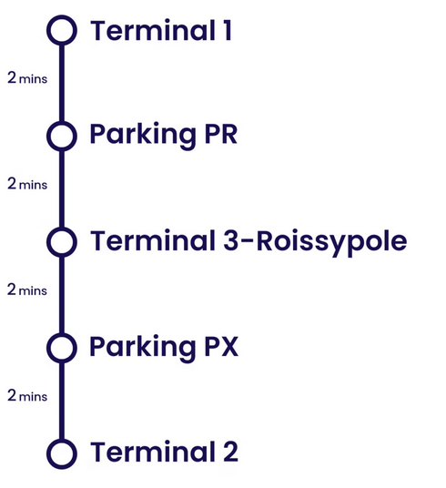

### 1.2.4 CDGVAL station <-> hotels, train stations and services

-   Terminal 1
-   Parking PR
    -   PR car park
    -   Courtyard by marriott
    -   Holiday inn express
    -   Innside by meliá
    -   Mercure paris cdg airport
    -   Moxy paris cdg airport
    -   Residence inn by marriott
-   Terminal 3-roissypole
    -   Aéroport Charles de Gaulle 1 Train Station (RER B)
    -   Bus station
    -   Hotel shuttles
    -   CitizenM paris cdg
    -   Radisson blu CDG airport
    -   Novotel paris cdg airport
    -   Hilton paris cdg airport
    -   Ibis paris cdg airport
-   Parking PX
    -   PX car park
-   Terminal 2	
    -   Aéroport Charles de Gaulle 2 Train Station (RER B + TGV)
    -   Luggage storage
    -   Sheraton paris cdg airport
    -   Yotel

### 1.2.5 Catching CDGVAL

-   Follow the appropriate CDGVAL signage to Terminal 1, 2, 3 or to car parks PR and PX.
-   All CDGVAL stations provide step-free access to the platforms for passengers with reduced mobility and those traveling with strollers or luggage.
-   Please note that baggage carts are not permitted in elevators, on platforms, or onboard CDGVAL trains for safety reasons.

#### 1.2.5.1 Terminal 1

-   The station entrance is located on Level 2 of the terminal.
-   Access to and from the Arrivals level is available by lift only.

  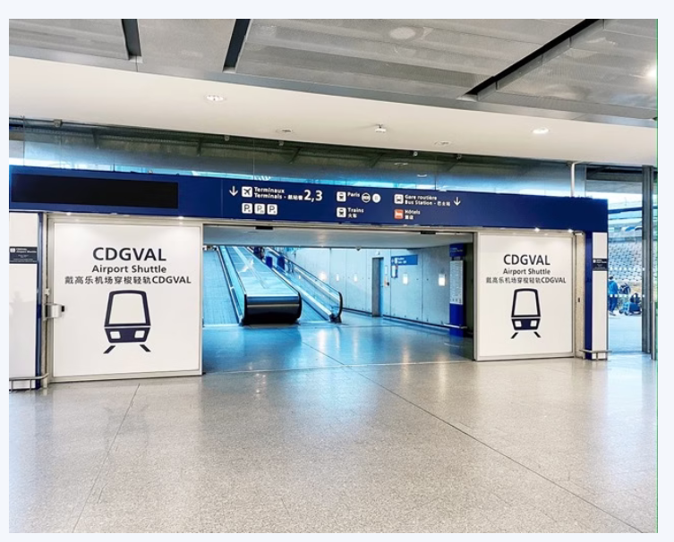

#### 1.2.5.2 Terminal 2

-   The station entrance is located next to the Aéroport Charles de Gaulle 2 Train Station. 
-   It is just a few minutes' walk from Terminals 2A, 2B, 2C, 2D, 2E, and 2F.
-   Terminal 2G can be reached by N2 shuttle bus from Terminal 2F.

  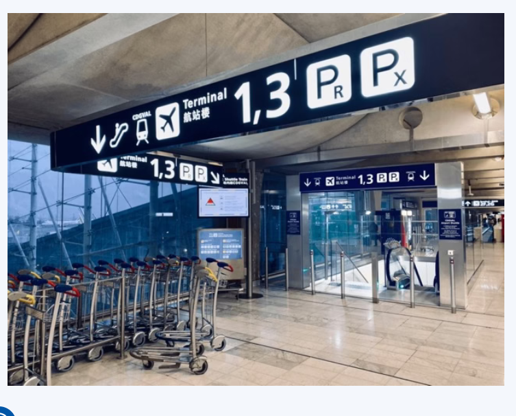

#### 1.2.5.3 Terminal 3-Roissypole

The station entrance is located inside the Aéroport Charles de Gaulle 1 Train Station, just a few minutes' walk from Terminal 3.

  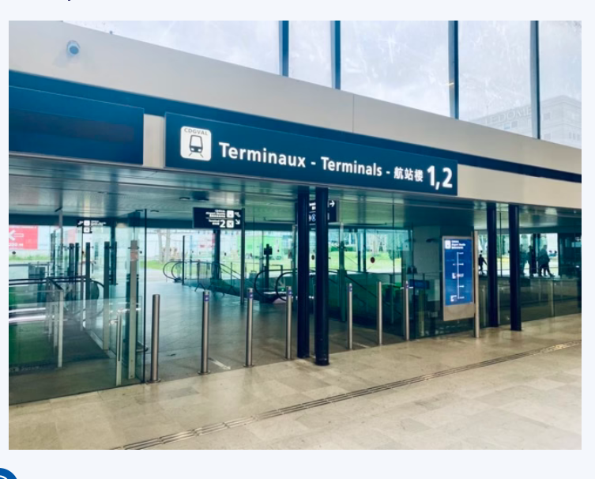

## 1.3 Airport Layout

-   Terminal 1, Terminal 2 and Terminal 3, as well as the Roissypole area and the remote PR and PX car parks, are served by the CDGVAL automated shuttle.
-   Terminal 2 is divided into several halls (2A to 2G), which may be some distance apart. You can travel between them on foot or by using the N1 or N2 shuttle buses. Journey times range from 5 to 10 minutes, and can be up to 30 minutes depending on the distance.
-   Once on site, follow the signs.

  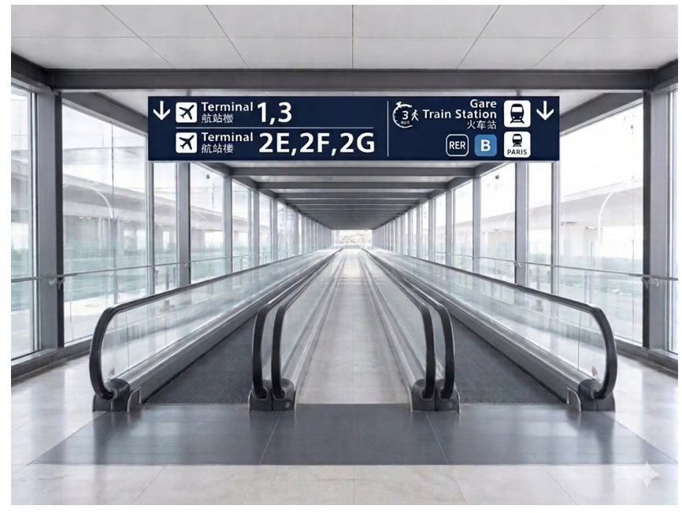

  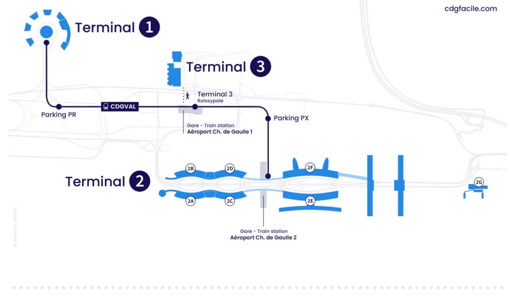

## 1.4 Navigating Terminal 2 (Halls 2A to 2G)

-   Terminal 2 is divided into several sub-terminals: 2A, 2B, 2C, 2D, 2E, 2F and 2G.
-   Terminals 2A to 2F are connected landside (before security) by covered walking corridors, allowing passengers to move between most halls in approximately 5 to 15 minutes. The N1 shuttle bus is also available for transfers within this area.
-   Terminal 2G is a satellite terminal located separately from the main Terminal 2 complex. It is not accessible on foot from the other terminals and can only be reached via the N2 shuttle bus departing from Terminal 2F.

  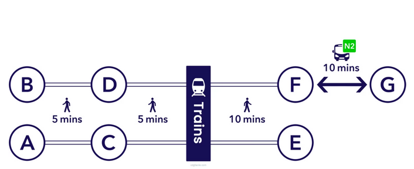

## 1.5 Navigating Between Terminals 1, 2, 3

-   You cannot walk between Terminals 1, 2 and 3.
-   The CDGVAL automated shuttle train is the fastest way to travel landside between Terminal 1, Terminal 2, and Terminal 3/Roissypole. It also provides free, convenient access to key airport areas, including on-site airport hotels, train stations, and long-stay parking zones (PR and PX).

  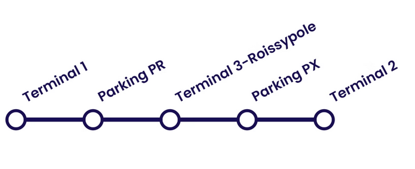

## 1.6 How to Reach Train Stations

-   There are two railway stations at Charles de Gaulle Airport.
-   Simply follow the Trains signs in the terminals to find them quickly.

### 1.6.1 Aéroport Charles de Gaulle 2

-   This is the main hub for TGV high-speed trains and the RER B line to central Paris.
-   It is located within Terminal 2 and can be reached on foot from most Terminal 2 halls (2A to 2F).
-   Passengers arriving at 2G must take the N2 shuttle bus to the station.
-   Those arriving at Terminals 1 or 3 should take the free CDGVAL automated shuttle train to Terminal 2 and follow the signs for Trains.

### 1.6.2 Aéroport Charles de Gaulle 1

-   This station serves Terminals 1 and 3 via the RER B line.
-   From Terminal 3, the station is within walking distance.
-   From Terminal 1, take the free CDGVAL automated shuttle train to the Terminal 3-Roissypole stop, then follow the signs for Paris RER B.

  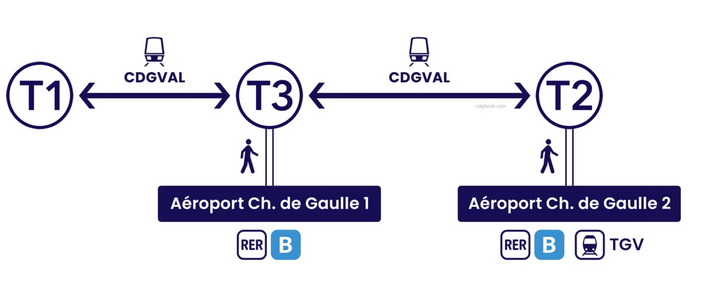

## 1.7 Conclusion

### 1.7.1 CDGVAL: the automated shuttle between terminals

-   The CDGVAL is a free automated metro that serves the airport's main terminals and car parks seven days a week, from 4am to 1am, with trains running every four minutes on average. 
-   It provides a quick connection between Terminal 1, Terminal 3 and Terminal 2 via a central station linking halls 2C-2D and 2E-2F and serving the SNCF-TGV (High-speed train) station.
-   The Roissypôle stop on the CDGVAL provides access to the RER B station (Regional train to/from Paris) CDG 1 Airport, the coach station, hotels, shops and services.
-   The CDGVAL also serves several long-stay car parks, including the PR, PX and PX Eco car parks.

### 1.7.2 Shuttle buses N1 and N2: inter-hall connections

-   To complement the CDGVAL, two free bus shuttles operate between specific halls of Terminal 2. 
-   The **Shuttle N1** runs between halls 2AC, 2BD, and 2EF, with a stop at the TGV-RER station in Terminal 2.
-   The **Shuttle N2** connects halls 2F and 2G.
-   These buses are ideal for reaching areas that are not directly served by the CDGVAL.

### 1.7.3 LISA shuttle: linking halls K, L and M of Terminal 2E

-   The **LISA shuttle** provides a free airside connection between halls K (main boarding area), L, and M within Terminal 2E.
-   It operates exclusively for passengers who have already passed through security checks.

### 1.7.4 Shuttle routes

  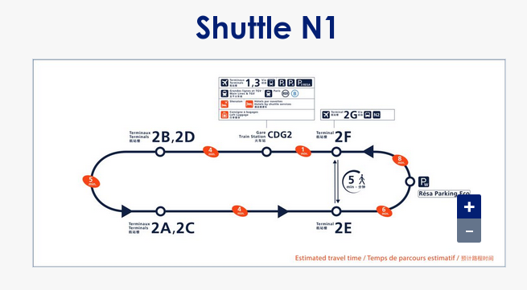

  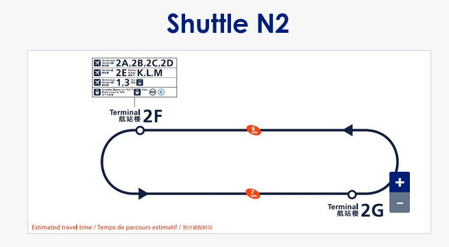

  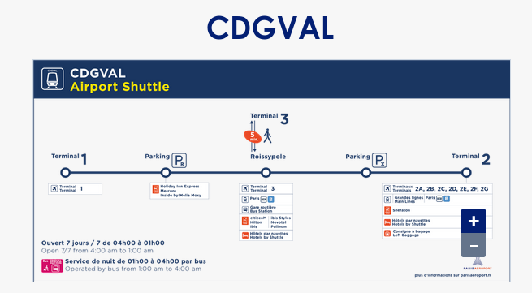

### 1.7.5 CDG layout

  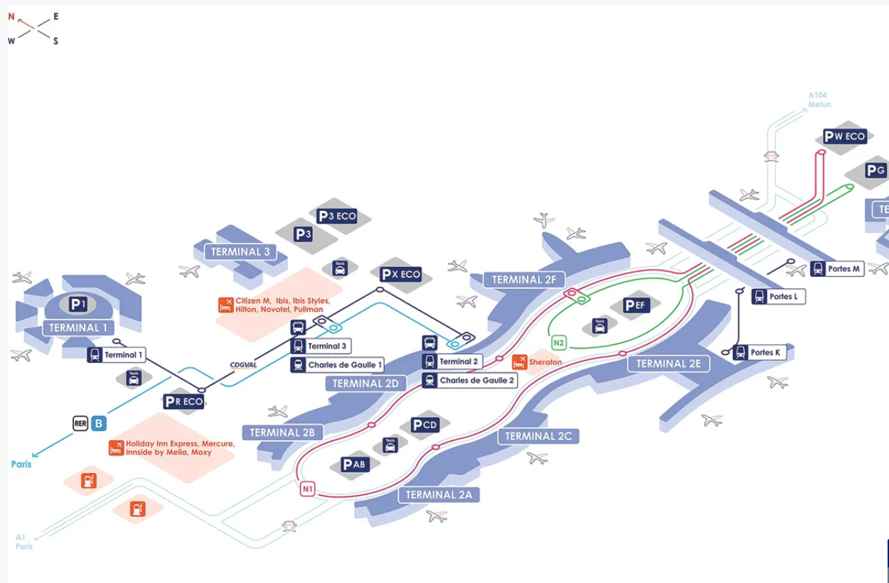

